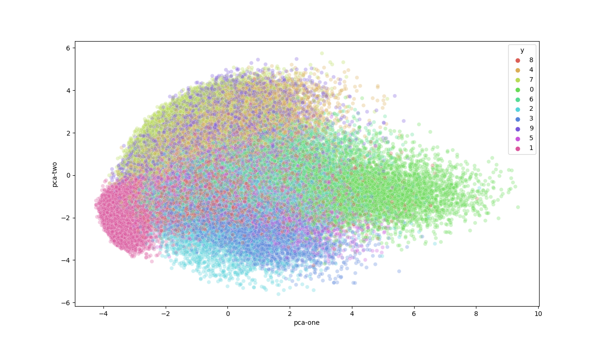
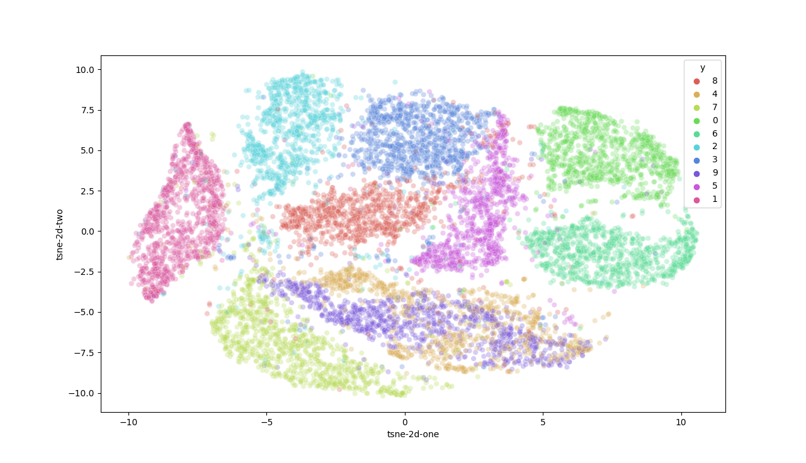

# t-SNE, PCA or AEVB

## Result

    
    

## References
* https://lvdmaaten.github.io/tsne/
* https://scikit-learn.org/stable/modules/generated/sklearn.manifold.TSNE.html
* https://towardsdatascience.com/visualising-high-dimensional-datasets-using-pca-and-t-sne-in-python-8ef87e7915b
* https://arxiv.org/pdf/1312.6114.pdf
* https://ermongroup.github.io/cs228-notes/extras/vae/